# AGENTS.md — développer le framework waterfall

Guide de l'agent qui modifie **ce repo** (le framework lui-même). Trois publics, trois docs :
utilisateur → `README.md` ; agents d'un workflow en run → `agents/_shared/constitution.md` ;
dev du framework → ce fichier.

## Philosophie

- **La state machine est la seule source de vérité.** `scripts/wf-orchestrate.sh` décide ; les agents exécutent. Tout ce qui peut être décidé par le script doit l'être par le script, jamais délégué au jugement LLM (cause racine ARCH-03).
- **Personas hint-driven.** Les `.md` ne recopient JAMAIS les tables du script (step→agent, params, séquences) : le contrat runtime vient de `--query` (`agent`, `hint`, `expected_params`) et de `--help`. Toute table recopiée finit par mentir (ARCH-06) — `tests/wf-doc-drift.bats` l'interdit en CI.
- **Échec bruyant > défaut silencieux.** Jamais de fallback muet vers un état par défaut (F-030 : état fantôme = pire mode de panne).
- **Politique de retrait.** Le rodage in vivo ajoute de la prose ; la dette de prose sature les contextes (ARCH-07). Chaque fix doit envisager une suppression, pas seulement un ajout.
- **Noms canoniques d'artefacts** : `PRD.md, specs.md, acceptance.md, design.md, tasks.md, tracking.md, review.md, ui.md, retro.md`. Owners : constitution §Mapping artefacts → owners. Tout autre nom est un drift (F-033/F-034).

## Carte du repo

- `scripts/wf-orchestrate.sh` — state machine (~3600 l., bash + node/jq inline). `--help` = contrat complet (phases/steps générés depuis `STEPS[]`).
- `scripts/wf-step-agents.sh` — tables step→agent + overrides light/dark (qui possède quel step).
- `hooks/wf-auth.sh` — hook PreToolUse : identité sur `--complete` (regex command-line) + **matrice artefact→writers sur Write/Edit** (file_path structuré, tous rôles) + flat-deny des écritures Bash d'artefacts (ARCH-08, zéro exception — canaux scriptés : `--log`, `--append`). Lit `agent_type` du payload harness ; `.team-registry.json` = traçabilité pure, jamais consulté pour l'auth (DEC-001).
- `scripts/lib/wf-paths.sh` — resolveur `PROJECT_ROOT` canonique, sourcé par orchestrate/watchdog/registry (F-032). Ne jamais résoudre via `script_dir/..`.
- `scripts/wf-watchdog.sh`, `wf-registry.sh`, `wf-read-config.sh` (validation `.wf-config.json`), `wf-check-*.sh` (preflights).
- `agents/*.md` — personas des 8 rôles ; `agents/_shared/constitution.md` — invariants universels.
- `commands/` + `skills/` — `/waterfall:new|resume|quit`, variantes light (`wf-pm-light`, `wf-tl-light`).
- `wf/templates/{fr,en}/` — templates d'artefacts (miroirs) ; `wf/needs/` — runtime ; `wf/archives/` — needs clos (ne pas éditer).
- `backlog.md` — findings `F-xxx` + causes racines `ARCH-01..10`. **À lire avant de toucher au cœur** ; c'est l'historique des pièges déjà payés.
- `tests/` — bats : wf-auth (63), state machine (`wf-orchestrate-*.bats`, helper isolé `wf-orchestrate-helper.bash`), anti-drift doc (`wf-doc-drift.bats`).

## Workflow — la state machine, phase par phase

**10 phases** : BOOTSTRAP → REQUIREMENTS → FUNCTIONAL_SPECS → TECHNICAL_DESIGN → REVIEW (boucle) → PLANNING → IMPLEMENTATION → CODE_REVIEW (boucle) → VALIDATION → CLOSURE.

Schémas dérivés de `compute_next_step` (`scripts/wf-orchestrate.sh`) — mode `team` nominal, owner canonique entre parenthèses (`dark_factory=on` réassigne les checkpoints HO à `or`). Pointillés = court-circuits `subagent-light`. Les noms de steps sont vérifiés contre `STEPS[]` par `tests/wf-doc-drift.bats` ; les transitions ne sont garanties que par la lecture du script — en cas de doute, le script a raison. Non représentés (lisibilité) : `pause`/`abort` sur chaque checkpoint (→ TERMINAL PAUSED/ABORTED), les auto-skips light par rôle absent.

### Vue d'ensemble

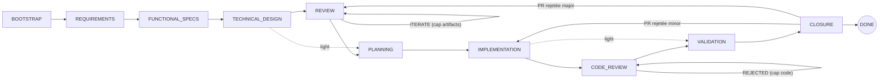

### BOOTSTRAP — nommage, branche, team

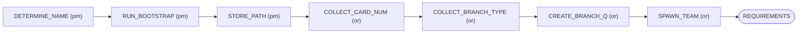

### REQUIREMENTS — PRD

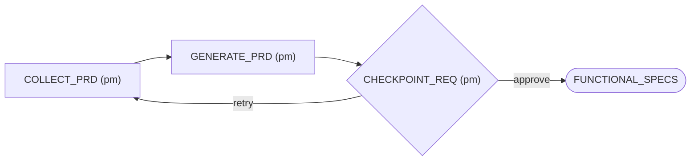

### FUNCTIONAL_SPECS — specs + acceptance (PO)

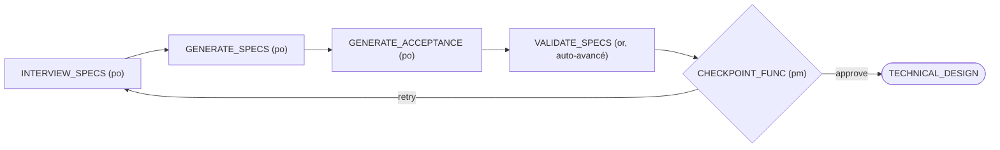

### TECHNICAL_DESIGN — design (TL, + DS si has_ui)

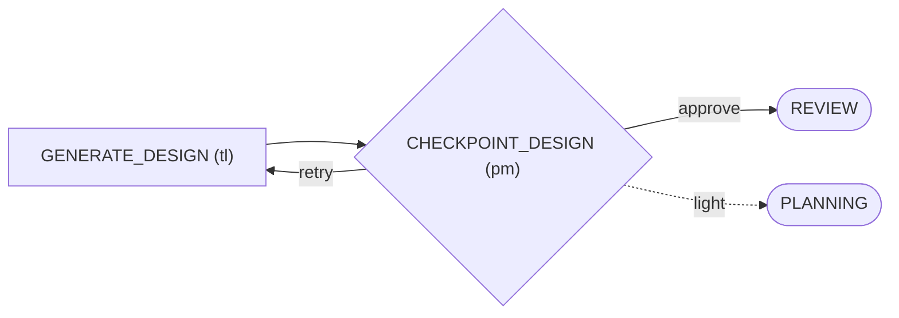

### REVIEW — boucle de revue d'artefacts (cap `review_loops.artifacts`)

RV pose verdict + routage à `RV_REVIEW` (persistés en state) ; `CHECK_EXIT` et `DISPATCH` en dérivent leurs décisions (ARCH-03-A/C).

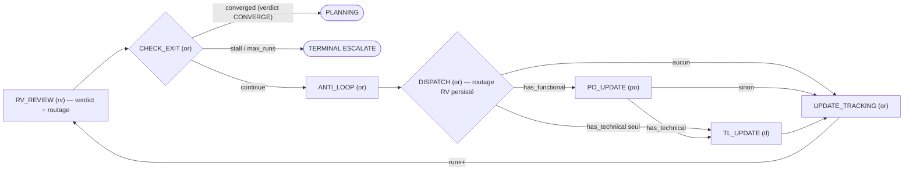

### PLANNING — tâches + worktrees (TL)

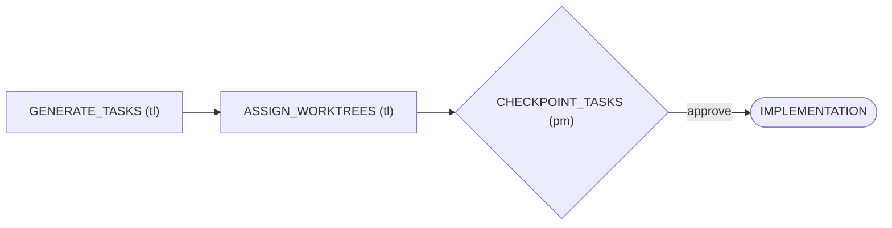

### IMPLEMENTATION — pool DV piloté par TL

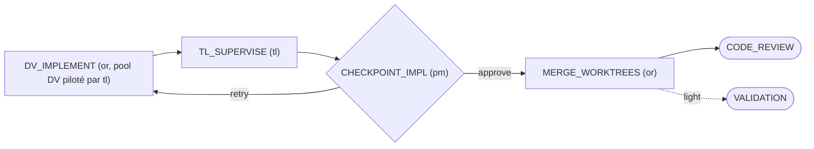

### CODE_REVIEW — boucle de revue de code (cap `review_loops.code`)

RV pose son verdict `APPROVED|REJECTED` à `RV_CODE_REVIEW` (persisté) ; `CHECK_CR_EXIT` en dérive la convergence (ARCH-03-B).

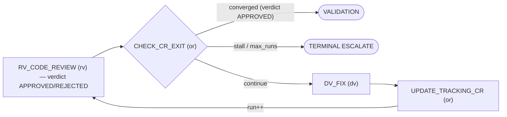

### VALIDATION — recette PO/QA/HO

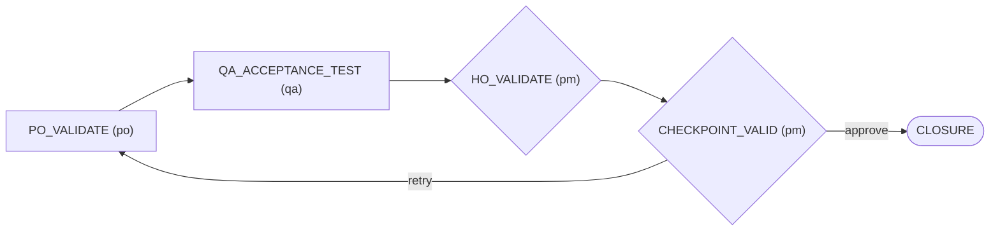

### CLOSURE — commit, PR, bilan, archive

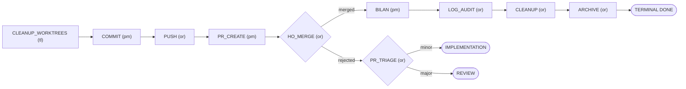

## Modes

2 `agent_mode` (`team` défaut / `subagent-light`) × `dark_factory` on/off — config `.wf-config.json` racine du projet consommateur. `subagent` est un **alias déprécié de `team`** (F-039 — fusion : l'ancienne mécanique synchrone subagent n'a plus lieu d'être avec l'API Agent Teams native, `wf-read-config.sh` le mappe sur `team`). En light, les steps des rôles absents sont auto-skippés (`_wf_auto_skip_light`) et REVIEW/CODE_REVIEW sont court-circuités. La combinatoire est le point fragile du moteur (ARCH-05) : toute modif de skip/short-circuit doit passer la matrice de tests `wf-orchestrate-skip.bats`.

## Règles de dev

- **Avant de toucher au cœur** : lire la section ARCH-xx concernée du backlog. Les récidives F-017→F-030 ont coûté des semaines.
- **Tests** : `bash -n` sur tout `.sh` modifié ; fichier bats ciblé pendant le dev (**un à la fois** — lents sous git-bash Windows, chaque test spawne node) ; `bats tests/` complet avant de pousser un lot.
- **Le hook wf-auth piège aussi le dev** : (a) toute commande Bash contenant un littéral `--complete <PHASE>:<STEP>` est interceptée (le main = `agent_type=pm`) → exercer ces cas via bats ou un sous-script `bash x.sh` ; (b) l'outil Write des subagents est bloqué hors `wf/needs/` → un subagent crée ses fichiers via heredoc Bash.
- **Portée des fixes** : un `.sh` est actif au prochain appel ; un persona `.md` exige `/reload-plugins` ET ne touche jamais un agent déjà spawné (atterrit entre needs).
- **CRLF** : repo en CRLF sous Windows — `tr -d '\r'` avant toute comparaison d'extraction shell vs `jq`.
- **Findings** : bug observé in vivo → entrée `F-xxx` au backlog (constat/impact/reco), résolution datée dans la même entrée. Pas de fix silencieux.
- **Commits** : conventionnels, sans accents dans le sujet, référencer `F-xxx`/`ARCH-xx`. Pousser sur `origin develop` à chaque lot clos.
- **Chirurgie** : ne toucher que ce qui est demandé ; un drift adjacent repéré se note au backlog, il ne se corrige pas en douce dans le même commit.
