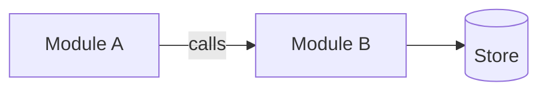
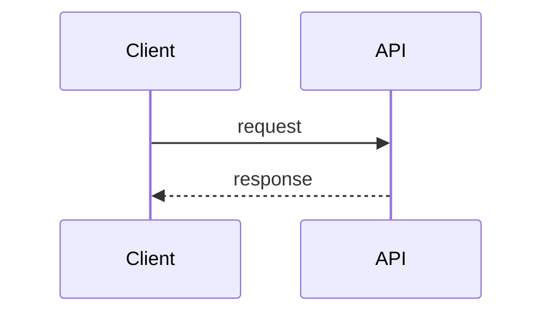
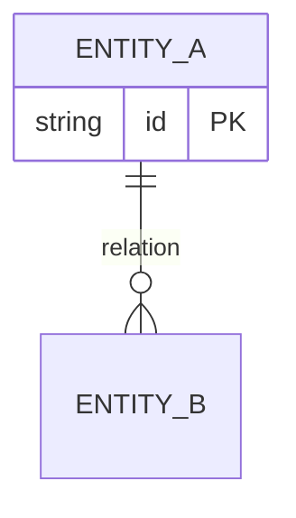

# Technical Design — {{name}}

<!-- TODO: traduction EN à compléter -->

<!-- Written by TL during TECHNICAL_DESIGN phase -->
<!-- Code snippets here are ARTEFACTUAL (interfaces, pseudo-code, type definitions) -->
<!-- NEVER executable production code — that belongs to DV during IMPLEMENTATION -->
<!-- Sections that are not relevant can be marked N/A -->

## 1. Overview
<!-- One-paragraph summary; reference related EX-xxx and INV-xxx -->

n/a

## 2. Architecture
<!-- High-level Mermaid diagram (flowchart / graph). Modules + responsibilities + data flow. -->
<!-- See https://mermaid.js.org/syntax/flowchart.html -->

n/a

## 3. Interfaces
<!-- Public APIs: method signatures, types -->
<!-- Contracts between modules -->
<!-- Code snippets ARE allowed here: interfaces, traits, type definitions (illustrative only) -->
<!-- For interactions between actors/modules: use a Mermaid sequenceDiagram -->
<!-- See https://mermaid.js.org/syntax/sequenceDiagram.html -->

n/a

## 4. Data Model
<!-- Entities, relationships, schemas. Mermaid erDiagram OR classDiagram. -->
<!-- See https://mermaid.js.org/syntax/entityRelationshipDiagram.html -->

n/a

## 5. Invariants Preserved
<!-- For each INV-xxx in specs.md, explain how the design preserves it -->

n/a

## 6. Trade-offs and Alternatives Considered
<!-- Why this approach vs alternatives -->
<!-- Limitations accepted -->

n/a

## 7. Dependencies
<!-- New external libraries -->
<!-- External services (if applicable) -->

n/a

## 8. Security & Performance Notes
<!-- Risks identified -->
<!-- Performance constraints -->

n/a
